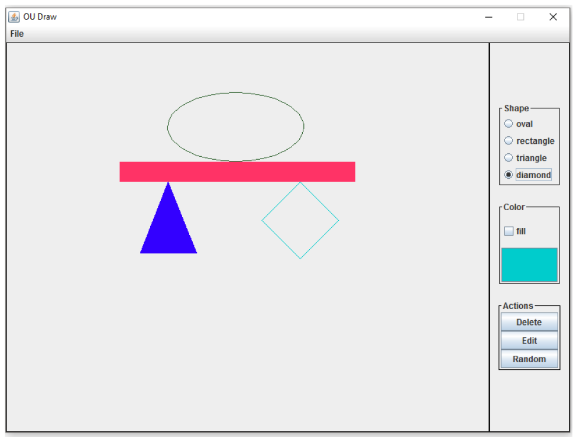
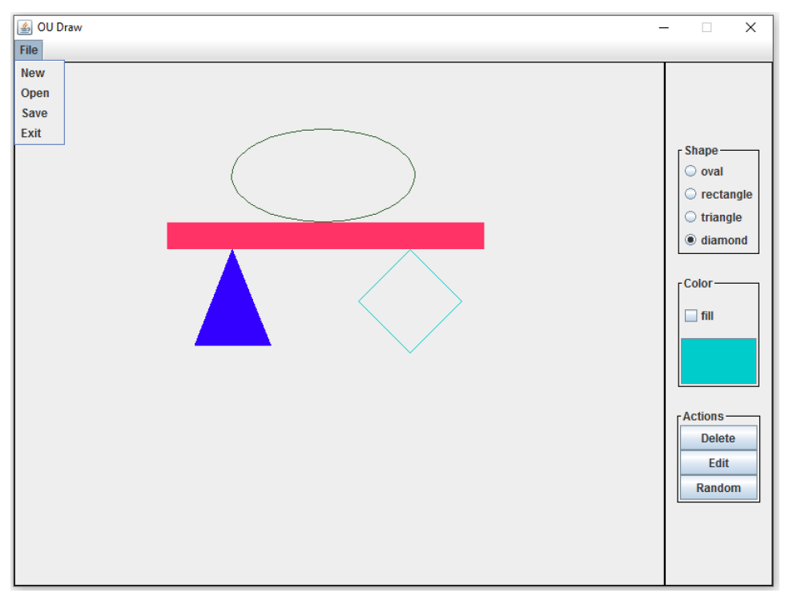
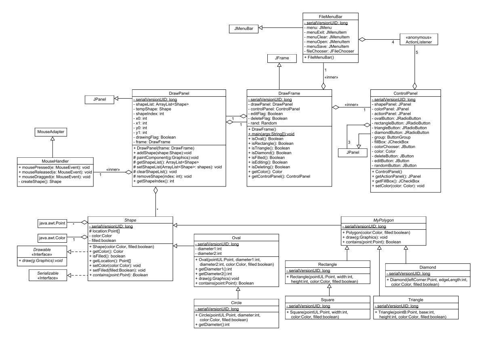

实验十二：绘图和序列化
======

# 介绍
在实验10中，我们学习了绘制简单图形。为生成这些图形，我们使用了**Graphics**类提供的底层图形生成方法。最终的绘图是在*main()*方法中通过创建一组固定图形来完成的。
在本实验中，我们将构建一个图形用户接口可以让用户使用任意图形绘图。对于任意给定的图形，用户将能够选择图形类型，它的颜色，图形是否被填充满。图形的位置和大小随后由用户在绘图面板中的点击和拖拽来确定。另外，GUI将提供一个*File Menu*，让用户可以加载和保存绘图，创建一个新绘图，和退出程序。

# 学习目标
完成本实验后，你应该能够：
1. 为graphics frame创建下拉菜单
2. 为下拉菜单项附加动作
3. 用恰当的对话框和各种鼠标事件和用户进行交互
4. 打开并读取文件，将对象写到文件
5. 在一个panel上创建一组简单图形

# 准备
将现有的lab12实现导入到你的eclipse工作区，
- 下载[lab12](lab12.zip)实现
- 在Eclipse中，选择*File/Import*
- 选择*General/Existing projects into worksapce*，点击*Next*
- 选择*Select archive file*，导航到lab12.zip文件，点击*Finish*

# 绘制图形
下面是部分绘图完成之后的GUI截图：

右侧的控制面板允许用户做：
- 选择四个形状之一：椭圆，矩形，三角形和菱形
- 确定图形是否要填充颜色
- 选择要绘制的颜色
- 删除图形
- 编辑图形的颜色
- 创建一个随机生成的对象

在绘图面板内的鼠标事件导致如下行为：

- 点击鼠标键：当前游标位置决定：
    - 在绘图模式：对象的第一个角被绘制
    - 在编辑和删除模式：选中被编辑或删除的形状
- 按住并移动游标（在绘图模式）：当前游标位置决定对象的第二角。一个临时对象将被绘制，给用户展示如果选择的话最终对象长啥样
- 松开鼠标按钮（在绘图模式）：当前绘图位置决定对象的第二角。一个新对象被添加到对象列表

注意用户选择的第一和第二个点有可能有相对关系。在创建图形对象，这两个点必须被转换成恰当的参数传递给图形的构造函数。

三个不同对象的位置和长度有下面确定：

- 矩形和椭圆形：用户选择的两个点决定了这些形状的对角。和实验10一样，这些图形的构造函数以左上角、宽度和高度（或直径）作为输入参数。
- 三角形：我们只考虑底部和x轴对齐的等腰三角形。用户指定的第一个角定义了三角形底部的第一个定点。第一和第二个角之间的差决定了底的长度和三角形的高度。
- 菱形：用户选择的点定义了菱形的第一个顶点。选择的第二个点决定了菱形相对于第一个点的方向，包括边的长度。菱形构造函数以最左边点和边长度作为输入参数。

图形用户接口也包括一个文件菜单：

文件菜单的动作包括：

- **New**：在和用户确认之后，清除绘图
- **Open**：在提示用户打开一个文件之后，从文件中读取一个绘图。出错的话在弹出对话框中显示错误信息。
- **Save**：在提示用户要保存的文件之后，将绘图写入文件。出错的话在弹出对话框中显示错误信息。
- **Exit**：程序立马退出

# UML
本实验的UML如下，下半部分的类只比实验10有少量修改。他们已经被完全提供给你。UML上半部分的类比实验10已经进行了大量修改，有些是为本实验新增的。

# 实验说明
UML中展示的所有类在lab11.zip中都有提供。

### 说明1
大部分类都已经被实现，你必须添加的关键类是：
- **DrawPanel**
    - paintComponent():完成实现
- **DrawPanel.MouseHandler**
    - mousePressed(): 当在不同模式（绘图，编辑，或者删除），处理鼠标按下的含义
    - mouseDraggged(): 在绘图模式时处理更新临时图形
    - mouseReleased(): 在绘图模式时最终定案绘制的图形，并将其添加到图形列表
    - createShape(): 创建正确的图形，取决于鼠标选中的点，选中的图形类型，颜色和填充色。
- **DrawFrame.FileMenuBar**
    - 完成菜单的实现
    - 增加四种菜单项的行为代码
- **DrawFrame.ControlPanel**
    - 定义颜色按钮的行为

### 说明2
除了规定之外，不要给类添加额外功能

### 说明3
不要忘记注释

# 最后步骤

### 步骤1
使用Eclipse生成Javadoc
- 选择*Project/Generate Javadoc...*
- 确保你的项目被选中，包括所有的Java文件
- 选择*Private*可见性
- 使用缺省的目标目录
- 点击*Finish*

### 步骤2
在Eclipse或者你常用的浏览器中打开lab12/doc/index.html文件。 确保Javadoc中包含你的类，所有的方法包含必要的Javadoc文档。

