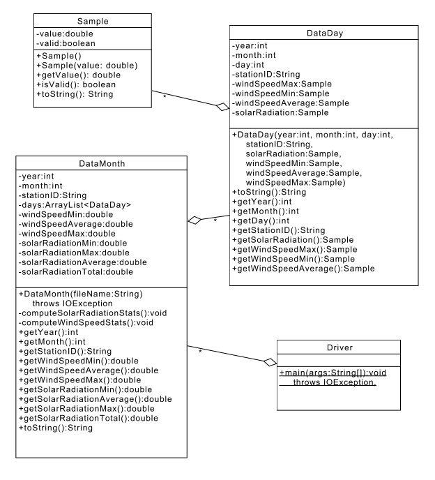

项目1：从文件中读取数据
======

# 介绍
俄克拉荷马州的[Mesonet](http://www.mesonet.org)是仅面向该州的天气观测站网络。该网络每隔5分钟为该州的每个乡村提供各种天气观测数据。Mesonet已运行有20年，它为我们理解天气和气候提供了无价的资源。本项目的数据将会从这些观测站提供的数据推导出来。

本项目中，我们会关注一个观测站(Tishimingo)，且仅关注风和太阳辐射数据。后面的项目会扩展到其它观测站和额外的天气数据。我们提供的数据是CSV(comma separated file)格式的，其中附有Tishimingo的每日汇总信息。

我们提供了Tishimingo几年的风速和太阳辐射数据，你的任务是读取数据文件，解析数据，用这些数据创建恰当的对象，并用最大，最小和平均数学函数汇总数据。你也需要使用单元测试来验证你的解析和计算是正确的。更多细节在下面的项目步骤中。

注意：由于一些特殊情况，例如掉电或者传感器错误，有时候某天某个观测站的某个传感器的数据会缺失，这些情况在文件中用小于等于-900的值表示，请确保你没有在你的统计汇总中使用这些特殊数据。

下图是Mesonet数据样例：


# 学习目标
完成本项目后，你应该能够：
1. 从一个文件中解析结构化数据
2. 使用文件中解析的数据创建对象
3. 对字符串做数字转换
4. 写代码实现数学函数
5. 利用单元测试确保你的代码功能正确
6. 给出Javadoc格式的文档

# 成功策略
- 和其它组员一起做，经常讨论
- 尽早开始做项目，因为该项目一天内完不成
- 以增量的方式实现和测试你的项目组件，不要等到整个项目都完成了再开始测试，我们建议你从最底层的类(*Sample*)开始，然后逐步到最高层(*DataMonth*)。
- 以增量方式写文档，不要等到整个项目都实现完成再补文档，在实现代码之前先写文档是一个好的实践。

# 准备工作

将提供的项目1实现导入到你的eclipse工作区：

1. 下载[project1.zip](project1.zip)
2. *File*菜单：*Import*
3. 选择*General/Existing Projects into Workspace*，然后点击*Next*
4. 选择*archive file*：导航到project1.zip文件
5. 点击*Finish*
6. 一旦你创建了新项目，最初它并不知道如何找到标准Java库（根据你配置的不同而不同）。在一个提供的Java文件中，找一个对标准类（例如String）的未定义引用，将鼠标置于其上，Eclipse会提示修复问题的方法：
	- 选择*Fix project setup*
	- 选择*Add library: JRE System Library*
	- 点击*OK*

# 项目设计
当我们开始开发大的程序，想把所有细节都置于大脑中会变得越来越困难。计算机科学中的一个关键技能是学会大而化小、分而治之。这不仅包括解决问题的流程（将设计和实现、测试分离），也包括将实现切分成逻辑块，这些块相互独立，相互之间通过简单的接口通信。我们先以UML形式总结下关节的类，后面会详细讨论每一个类。



# 类和其它组件
### 步骤1
使用恰当的文档和格式化（Javadoc和内联文档）
- 文档对调试非常重要，文档也有助于其它组员理解你的项目，未来，文档也有助于你自己重新理解自己的代码。另外，在后续项目中，你可能会重用你的项目代码，所以不要在文档上偷懒。
- 使用我们在实验1中建议的文档标准

### 步骤2
创建一个称为**Sample**的类
- 这个不可变类仅仅包含一个样本值（一个称为*value*的double型变量）和一个布尔标记（称为*valid*），该标记表明样本是否有效
- 缺省构造函数创建一个无效样本
- 第二个构造函数接受单个double型值，构造时，如果值是有效的（>-900），那么*valid*属性就被设置为*true*，否则，该属性被设为false。我们期望只有在该样本有效时，该类的用户才会获取响应的值
- 该类包含所有的访问器(getters)方法，使用标准的名字。注意这里不用修改器(setters)方法
- 该类包含一个*toString()*方法，如果样本是有效的，返回一个包含样本值的字符串（保留小数点后4位数字），如果样本值无效，则返回"invalid"。下面是两个例子：
```
    invalid
    98.3480
```
### 步骤3
为**Sample**类实现单元测试，测试应当覆盖所有可能的情况

### 步骤4
创建一个称为**DataDay**的类，用于一个检测站的每日数据

-  检查下我们在项目中提供的一个CSV文件（见*data*目录）
-  这个不可变类包含年、月和日的实例变量（都是整型）
-  该类包含一个称为*stationID*的字符串
-  该类包含最大、最小和平均风速样本，总的太阳辐射样本（称为*windSpeedMax*，*windSpeedMin*，*windSpeedAverage*，*solarRadiation*）
-  该类包含单个构造函数，参数顺序见UML图
-  该类必须包含一组访问器(getters)方法，使用标准命名
-  该类必须包含一个*toString()*方法，该方法返回值的一个例子如下：
```
2004-10-08, UPLAND: Wind = [0.1000, 13.2300, 26.8930]，Solar Radiation = 15.5700
```
其中，Wind的值分别对应于最小、平均和最大值。

### 步骤5
为**DataDay**类实现单元测试，测试应当覆盖所有可能的情况

### 步骤6
创建一个称为**DataMonth**的类，用于表示整个月的样本
- 这个不可变类会包含一个称为*days*的类型为*ArrayList<DataDay>*的实例变量
- 该类也包含实例变量*windSpeedMax*，*windSpeedMin*，*windSpeedAverage*，*solarRadiationMax*，*solarRadiationMin*，*solarRadiationAverage*和*solarRadiationTotal*，都是double型
- 该类也包含表示年和月（都是整型），和stationID（字符串型）实例变量
- 该类只有一个构造函数，接受一个文件名作为参数（一个字符串），然后：
	- 读入每日的数据，并将每日数据添加到ArrayList，**在本项目中你必须使用*BufferedReader***，细节请参考实验3
	- 使用两个私有的助手函数，该构造函数会在实例变量中填充风速和太阳辐射的最小，最大和平均值。请确保在计算这些统计时忽略无效值
- 你可以假定每个文件中的每个测量至少包含一个有效样本，并且对于每个监测站仅包含一年和一个月。
- 该类必须包含UML中指定的访问器(getters)方法，使用标准的命名
- 该类必须包含一个恰当的*toString()*方法，一个样例（2016年6月）输出如下：
```
2016-06, TISH: Wind = [0.0000, 6.0417, 23.7100], Solar Radiation = [4.6000, 23.3545, 30.7200, 677.2800]
```
其中，*Wind*的值分别对应于最小，平均和最大值，*Solar Radiation*的值分别对应于最小，平均，最大和总的值。

### 步骤7
为**DataMonth**类写单元测试，创建一个测试用数据文件（少量天数就够了），验证max/min/averages/total是计算正确的。

### 步骤8
创建一个**Driver**类，包含你的main方法，该类将：
- 根据提供的数据文件创建一个**DataMonth**实例（文件名可以硬编码）
- 通过调用month的toString()方法做报告


#最后步骤
### 步骤1
使用Eclipse为你的所有类生成Javadoc，

### 步骤2
在Eclipse或者你常用的浏览器中打开project1/doc/index.html文件。 确保Javadoc中包含你的类（主要类和三个单元测试类），所有的方法包含必要的Javadoc文档。

# 注意
有此类和方法会抛出如下例外：*IOException*，*NumberFormatException*，*FileNotFoundException*。在本项目中，不处理而直接抛出例外是OK的。注意多个方法可能需要抛出例外，包括你的main方法（Eclipse会提示你）。本课程的后面部分我们会更详细的介绍例外。

double能表示的最大值是*Double.POSITIVE_INFINITY*，最小负数是*Double.NEGATIVE_INFINITY*。

在我们的UML图中，我们对象属性和方法，以及可见性，都有严格要求，**请不要随意改变设计**。

测试：不同的标记有"@test"的方法将以不同顺序执行（不要假定实现顺序）。但是，在某些情况下，你可能希望先执行一个方法，让它先构建数据结构并加载数据，让之后的测试数据使用这些数据，方法如下：

1. 将共享数据结构声明为测试类的静态*static*类变量
2. 使用标记有"@BeforeClass"的方法来初始化这些数据结构。记住，你需要先导入BeforeClass类（Eclipse会提示你导入）。


# 参考
- [Java API](https://docs.oracle.com/javase/8/docs/api/)
- 俄克拉荷马州的[Mesonet](http://www.mesonet.org)
- [Assert类API](http://junit.sourceforge.net/javadoc/org/junit/Assert.html)
- 一个[Junit Tutorial](https://dzone.com/articles/junit-tutorial-beginners)
- 


